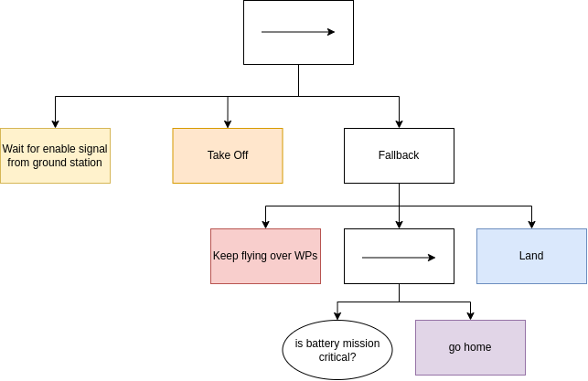
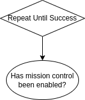
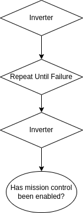
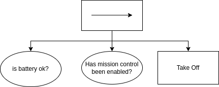
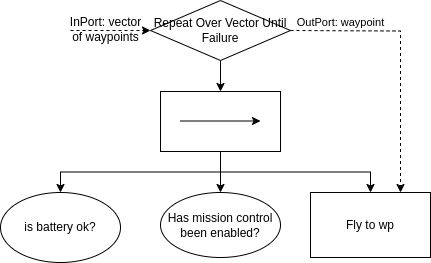
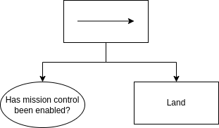
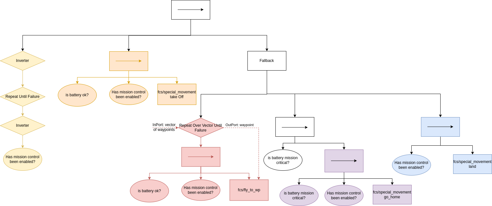

# Mission controller

The mission controller utilises [behaviour trees](https://en.wikipedia.org/wiki/Behavior_tree_(artificial_intelligence,_robotics_and_control)#:~:text=Article%20Talk,tasks%20in%20a%20modular%20fashion.).
In particular, it is based on c++ library called [BehaviorTree.Cpp](https://www.behaviortree.dev/).
Before continuing to read the explanation below, please familiarise yourself with the semantics of behaviour trees.

## Supported scenarios

One of the big advantages of behaviour trees is that they are easily configurable by a text file, which means the code can stay the same for different scenarios.
There is a folder `config` where you will find `xml` files, including example of behaviour trees.

## Monitoring scenario

A UAV needs to patrol an area which is specified by a list of waypoints described by their GPS coordinates. If the UAV reaches the last waypoint from the list, it flies to the first one and keeps repeating until an end condition occurs. There are two sources for the end condition to occur: either a command came from a ground station or the UAV’s battery is low.
In the former case, the UAV returns to the position where it started, e.g. to its home location.
In the latter case, we distinguish between two levels for low battery: it is either mission critical or safety critical. If the UAV’s battery produces mission critical status, then the UAV returns to its home location. Finally, if the battery status is safety critical,  the UAV lands immediately.

This scenario is supported by the `monitoring_scenario.xml`.

## Known limitations (as of 06/10/2023)

- the drone will perform "star" pattern on waypoints; this mean that the drone will fly from its home location to the wp and then return to its home location before flying to another wp. This is due limitations of dji_sdk library which doesn't allow to fly to a single wp but requires a set of minimal three of them, when the first and the last needs to be home locations
- it is assumed in this file, that actions of the drone cannot be interrupted. You can check bottom of this readme for an example of an extended tree which would handle if actions are interruptable. It may be worthit to investigate usage of STOP/PAUSE form MissionWpAction service. This should make the FLyToWp action interruptable. 

## Scenario tree explanation

The main behaviour of this case study is a sequence of four steps:

1. wait for enable signal from the ground station
2. take off
3. keep flying until the battery is not OK
4. handle the fact that battery is not OK

The very high level behaviour tree can look like this:

Due to complexity of each node, there are trees themselves. We can define their behaviour as follows.

### Wait for enable signal from ground station

- returns SUCCESS when mission controller is enabled
- returns RUNNING when mission controller is disabled
- returns FAILURE when unexpected error occurs (this is not supported as of 06/10/2023)

This node will not allow the execution of the tree to continue until the mission controller is enabled. After it is, the tree will move to the next node due to the fact that the root node is *sequence*.

#### Implementation

I have implemented a version of a *condition node* in order to check if mission control has been enabled by the ground station. The class is called *IsMissionEnabled*. The condition node has an input port *mission_enabled* which is set from the class *MissionController* which processes ROS service call.

The tree "Wait for enable signal from ground station" could look like this:

The decorator "Repeat until success" will produce status RUNNING until the condition returns SUCCESS. However, the BehaviorTree.Cpp library doesn't offer *Repeat until success* decorator node. It offers only *Repeat until failure* node. Hence, we need to add two inverters:

### Take off

- returns SUCCESS when the drone took of
- returns RUNNING when the drone is taking off
- returns FAILURE when:
  - battery is not OK
  - mission control is disabled
  - unexpected error occur (this is not supported as of 06/10/2023)

#### Implementation

Before requesting fcs_interface action to take off, we need to check if the two end conditions hasn't occurred. The call to `fcs_interfaction` action is wrapped using the standard ROS wrapper provided by the `BehaviorTree.cpp` library.

### Is battery <req_status>?

- returns SUCCESS when the current battery status provided by battery monitor is equal to req_status
- returns FAILURE otherwise
- returns RUNNING when the battery monitor hasn't published status yet

#### Implementation

I have implemented a condition node `IsBatteryRequiredStatus` which listens to a topic with the battery status. This condition node as an input *port* for defining the requested status.

### Fallback

- this is a standard fallback node
- we use it here because when the keep flying node fails, we want to react to it by a recovery strategy "go home"; if that one would fail too, the drone will land

### Keep flying over WPs

- never returns SUCCESS
- returns RUNNING until a failure occurs
- returns FAILURE when:
  - battery is not OK
  - mission control is disabled
  - unexpected error occur (this is not supported as of 06/10/2023)

#### Implementation

Before requesting the drone to fly to a waypoint, we need to check the end conditions too. Additionally, there are several waypoints over which the drone is suppose to patrol. Therefore, I have developed a new *decorator* node called *RepeatOverVectorUntilFailure*. This node takes a vector of waypoints as its input *port* and iterates over them until one of its childs return failure. The iteration is done using output port which passes the current waypoint to the *fly to wp* node which is again standard wrap of a ros action call.

### Is battery mission critical?

- returns SUCCESS when the battery monitor returns battery status MISSION_CRITICAL
- returns FAILURE when the battery monitor returns either OK or SAFETY_CRITICAL
- returns RUNNING if battery monitor hasn't published a status yet

#### Implementation

This uses the node IsBatteryRequiredStatus with input port set to MISSION_CRITICAL.

### Go home

- returns SUCCESS when the drone lands on the coordinates where it took off from
- returns RUNNING when the drone is flying or landing
- returns FAILURE:
  - battery is not mission critical
  - mission control is disabled
  - unexpected error occur (this is not supported as of 06/10/2023)

#### Implementation

The two conditions have been explained above. The actions is a standard wrap to ros action call.

### Land

- returns SUCCESS when the drone lands
- returns RUNNING when the drone is landing
- returns FAILURE:
  - mission control is disabled
  - unexpected error occur (this is not supported as of 06/10/2023)

For the land, we need to check only the condition if mission controller is enabled. We don't need to check the battery, as the land action will be requested only if the battery is safety critical.

#### Implementation

The same as for go home.

### The complete tree

### How to test without a drone

There is a launch file "dummy_mini_system_test.launch" in demos pkg which launches this mission controller, dummy fcs interface and battery monitor.

In terminals, run:
1. `roslaunch demos dummy_mini_system_test.launch`
2. `rostopic pub /dji_sdk/gps_position sensor_msgs/NavSatFix "header:
  seq: 0
  stamp: {secs: 0, nsecs: 0}
  frame_id: ''
status: {status: 0, service: 0}
latitude: 0.0
longitude: 0.0
altitude: 0.0
position_covariance: [0.0, 0.0, 0.0, 0.0, 0.0, 0.0, 0.0, 0.0, 0.0]
position_covariance_type: 0"` (This is needed that fcs_interface starts)

Then, you want to play with:

- calling a service `roservice call /mission_controller/enable_mission "{}"` to enable mission controller
- calling a service `roservice call /mission_controller/disable_mission "{}"` to disable mission controller
- publishing `rostopic pub /battery_monitor/battery_status uav_msgs/BatteryStatus "input_msg_id: 0
status: 1" ` (see uav_msgs/msg/BatteryStatus for value corresponding to different statuses) (TODO: replace this by raw battery state when you expand dummy fcs interface)

Sending the services/changing battery status would allow you to influence what parts of the tree are being executed.

### Possible expansion when actions will be interruptible

I think that reactive fallback node would be great way how to allow for an interruptible actions. This means that each interruptible action (i.e. take off, land, go home, fly to wp) would now be replaced by a tree where top node is reactive fallback and its children are two condition nodes (battery and mission enable) and the actual action node. 

An explanation of its functionality for FlyToWp is:

First, the reactive fallbacks get triggered. Then, it triggers the condition “Has the ground station requested a stop?”. **Notice we need to work with negations**. This is beacuse it is fallback - the children to the right are triggered only when there is a **failure** The outcome of a condition node is either SUCCESS or FAILURE.
In case of a SUCCESS, the reactive fallback will be SUCCESS too. Hence, the drone will not fly anywhere and it will continue the rest of the tree.
In case of FAILURE, the reactive fallback will trigger the condition node "Is the battery **NOT** Ok?". Again, the outcome is either SUCCESS or FAILURE.
In case of SUCCESS, the reactive callback ends again.
Finally, in case of FAILURE, the FlyToWp action is triggered. Action nodes can return RUNNING, SUCCESS and FAILURE.
In case of RUNNING, the reactive fallback node will trigger again the first condition node (i.e. checking if mission controlled is enabled). This is important as this checking of the first child is exactly where the interruptibility comes to. If this child return SUCCESS, the fallbacks ends, which will trigger cancellation (halting) of the FLyToWp action.

In case of SUCCESS of FlyToWp, the reactive fallback node returns SUCCESS too and the next action node Land is triggered
In case of FAILURE of FlyToWp, the reactive fallback node returns FAILURE which gets propagated to the top node which returns FAILURE too and the whole scenario has failed.

